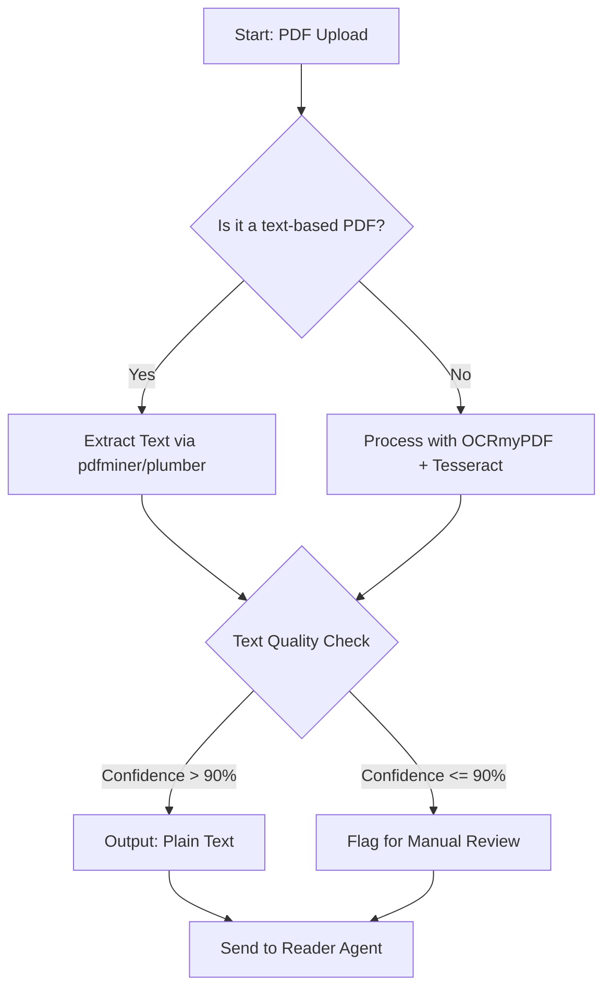

# OCR Pipeline Specification

**Date**: 2025-11-09
**Status**: Baseline

## 1. Overview

This document outlines the baseline OCR pipeline for the AI Buddy MVP. The goal is a deterministic, simple flow that reliably extracts text from uploaded documents, distinguishing between text-based and image-based (scanned) PDFs.

- **Scope**: Process single PDF documents to extract clean text.
- **Non-Goals (MVP)**:
  - Asynchronous processing or queues.
  - Direct image file uploads (e.g., PNG, JPG).
  - Automatic language detection.
  - Detailed layout analysis (e.g., bounding boxes).

## 2. Pipeline Diagram

## 3. Pipeline Implementation

The pipeline differentiates based on the PDF type:

- **Text-based PDFs**:
  - **Tool**: `pdfminer` or `pdfplumber`.
  - **Action**: Directly extract text content. This is fast and avoids unnecessary OCR.
  - **Rationale**: Most user-generated PDFs from Word, Google Docs, etc., are text-based.

- **Image-based (Scanned) PDFs**:
  - **Tool**: `OCRmyPDF` (which wraps `Tesseract`).
  - **Action**: `ocrmypdf --skip-text` is run on the file. This forces OCR on each page and reconstructs the PDF with an invisible text layer. The resulting text can then be extracted.
  - **Rationale**: `OCRmyPDF` is a robust, industry-standard tool that handles common issues like skewed pages and produces reliable output.

## 4. Confidence & Retry Logic

- **Confidence Score**: Text extraction from `OCRmyPDF` provides a confidence score. We will use the mean page confidence.
- **Threshold**: **90%**.
  - **Above 90%**: The text is considered clean and is passed directly to the next agent.
  - **Below 90%**: The session is flagged for **mandatory manual review**. The user is shown the extracted text and asked to correct it before proceeding.
- **Retries**: No automatic retries for low-confidence documents. The user is prompted to upload a higher-quality scan.

## 5. File I/O

- **Accepted Types**: `application/pdf` only for this pipeline.
- **File Naming**: Uploaded files are renamed to a `session_id.pdf` to prevent conflicts and ensure traceability.
- **Storage**: Files are stored in a temporary directory (`/tmp/uploads`) and are deleted after the session is complete or expires.

## 6. Outputs

The pipeline's primary output is a clean string of text.

- **Primary Output**: `plain_text` (String).
- **Structured Output (if applicable)**:
  - If tables are detected (future enhancement), they can be output as `tables.csv`.
  - For now, the output is a single text block.

## 7. Risks & Mitigations

- **Risk: Poor Scan Quality** (low contrast, blurry).
  - **Mitigation**: The confidence threshold (90%) will catch most poor-quality scans and route them to manual review. The UI will advise users to provide clear, well-lit scans.
- **Risk: Skewed or Rotated Pages**.
  - **Mitigation**: `OCRmyPDF` automatically de-skews and rotates pages before processing, minimizing this risk.
- **Risk: Complex Layouts** (multi-column, diagrams).
  - **Mitigation**: For MVP, we assume single-column layouts. Tesseract's reading order for complex pages may be imperfect. This is a documented limitation for the MVP.

## 8. Decisions & Next Steps

- **Decision**: Adopt the dual-path pipeline (pdfminer vs. OCRmyPDF) as the baseline.
- **Decision**: Set the initial confidence threshold for manual review at 90%.
- **Next Step**: Implement the `pdfminer` path for text-based PDFs.
- **Next Step**: Implement the `OCRmyPDF` path for scanned PDFs.
- **Next Step**: Create the UI for the manual review step.
